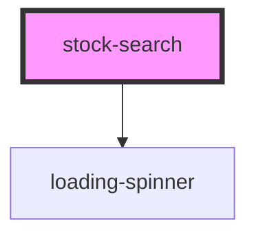

# stock-search

<!-- Auto Generated Below -->

## Properties

| Property    | Attribute    | Description | Type     | Default     |
| ----------- | ------------ | ----------- | -------- | ----------- |
| `stockName` | `stock-name` |             | `string` | `undefined` |

## Events

| Event         | Description | Type                  |
| ------------- | ----------- | --------------------- |
| `stockselect` |             | `CustomEvent<string>` |

## Dependencies

### Depends on

- [loading-spinner](../loading-spinner)

### Graph

----------------------------------------------

*Built with [StencilJS](https://stenciljs.com/)*
